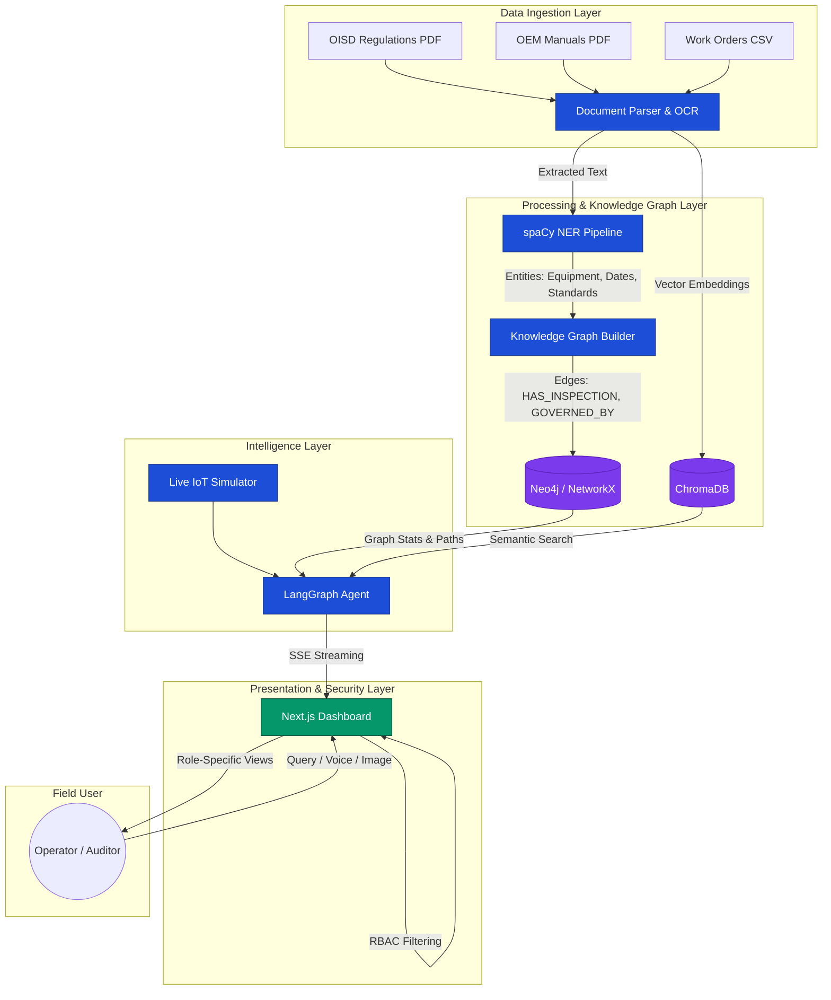

<div align="center">

# 🧠 Industrial Operations Brain

**An agentic AI system for industrial knowledge intelligence — built for operators, engineers, and auditors.**

[](https://www.python.org/)
[](https://nextjs.org/)
[](https://fastapi.tiangolo.com/)
[](https://www.langchain.com/langgraph)
[](LICENSE)

[Live Demo](#-getting-started) · [Architecture](#%EF%B8%8F-architecture) · [API Docs](#-api-reference) · [Contributing](#-contributing)

</div>

---

## Overview

**Industrial Operations Brain** is an enterprise-grade, agentic RAG (Retrieval-Augmented Generation) system purpose-built for heavy industry. It ingests complex industrial documents — SOPs, Work Orders, P&IDs, OEM Manuals, and regulatory standards (OISD, PESO) — and builds a semantic knowledge graph that powers role-aware, hallucination-resistant AI answers.

The system goes beyond simple Q&A: a multi-step **LangGraph agent** fuses live IoT sensor data, graph-traversal context, and vector search results before synthesising a final response — and can autonomously trigger actions such as raising SAP Work Orders.

---

## ✨ Features

| Feature | Details |
|---|---|
| 🔍 **Hybrid RAG** | Combines vector search (ChromaDB) with knowledge graph traversal (NetworkX / Neo4j) for grounded, citation-rich answers |
| 🤖 **LangGraph Agentic Pipeline** | Multi-step reasoning agent with guardrails, query rewriting, live-sensor checks, and closed-loop action execution |
| 📡 **Live IoT Integration** | Real-time sensor telemetry (temperature, vibration, pressure) fused into every agent reasoning step |
| 🗺️ **Dynamic Knowledge Graph** | spaCy NER extracts Equipment, Regulations, Dates, and Standards from documents; entities linked via HAS_INSPECTION, GOVERNED_BY, and CAUSED_BY edges |
| 🔐 **Full-Stack RBAC** | Role-Based Access Control enforced at the FastAPI backend and the Next.js UI — three personas (Operator, Engineer, Auditor) with distinct access scopes |
| 📊 **Interactive Graph Visualisation** | Physics-based, real-time force-directed graph rendered client-side via `react-force-graph-2d` |
| 🎙️ **Voice & Vision Input** | Web Speech API for voice queries; Gemini Vision for image/P&ID analysis |
| ⚡ **Server-Sent Events Streaming** | Token-by-token streaming of agent reasoning steps to the UI |
| 🧪 **Full Test Coverage** | 103-test backend suite (`pytest`), unit tests (`jest`), E2E tests (`playwright`), and load tests (`locust`) |

---

## 🏗️ Architecture



---

## 🚀 Getting Started

### Prerequisites

- **Python** 3.9+
- **Node.js** v18+
- **Tesseract OCR** — for scanning scanned industrial PDFs

```bash
# macOS
brew install tesseract

# Ubuntu / Debian
sudo apt-get install tesseract-ocr
```

### 1. Clone the Repository

```bash
git clone https://github.com/Mukilan-s18/Industrial-Operations-Brain.git
cd Industrial-Operations-Brain
```

### 2. Configure Environment

```bash
cp .env.example .env
# Add your GOOGLE_API_KEY to .env
```

### 3. Install Dependencies

```bash
# Backend
pip install -r requirements.txt
pip install -e .

# Frontend
cd frontend-next && npm install && cd ..
```

### 4. Generate the Demo Corpus

Creates a synthetic set of 7 industrial documents (SOPs, Work Orders, OEM Manuals, Checklists):

```bash
python demo_docs/generate_demo_docs.py
python scripts/build_vector_db.py
```

### 5. Launch the Application

A single script starts the FastAPI backend, IoT simulator, and Next.js frontend:

```bash
./run.sh          # macOS / Linux
./run.ps1         # Windows PowerShell
```

| Service | URL |
|---|---|
| Frontend Dashboard | http://localhost:3000 |
| Backend API | http://localhost:8000 |
| Swagger / OpenAPI | http://localhost:8000/docs |

---

## 📡 API Reference

### Ingestion

| Method | Endpoint | Description |
|---|---|---|
| `POST` | `/ingest/` | Upload a document to the ingestion pipeline (async OCR & chunking) |
| `GET` | `/ingest/status/{task_id}` | Poll progress of a large document ingestion task |
| `GET` | `/ingest/list` | List all successfully ingested files |
| `POST` | `/ingest/reset` | Purge the vector DB and graph for a fresh demo run |

### Agent & Chat

| Method | Endpoint | Description |
|---|---|---|
| `POST` | `/chat` | Submit a query to the LangGraph RAG pipeline (requires `X-User-Role` header) |
| `POST` | `/stream` | Stream the agent reasoning chain token-by-token via Server-Sent Events |
| `GET` | `/metrics` | Fetch live metrics: corpus coverage, cache size, API latency |
| `POST` | `/fallback/toggle` | Toggle emergency static demo fallback mode |

### Graph

| Method | Endpoint | Description |
|---|---|---|
| `GET` | `/graph/data` | Return graph nodes and edges as JSON for frontend visualisation |
| `GET` | `/graph/compliance` | Return active compliance gaps detected in the knowledge graph |

---

## 🔐 Role-Based Access Control

Three pre-configured personas with escalating access scopes:

| Role | Persona | Access | Restrictions |
|---|---|---|---|
| **Operator** | Ravi | SOPs, Checklists | Blocked from audit logs, engineering P&IDs |
| **Engineer** | Priya | SOPs, P&IDs, OEM Manuals | Blocked from raw compliance audit trails |
| **Auditor** | Arjun | All documents & standards | Full access including OISD/PESO reports |

Requests are authenticated via the `X-User-Role` HTTP header. Restricted keywords (e.g., `e-201`, `audit log`) trigger a backend RBAC block for unauthorised roles.

---

## 📂 Project Structure

```
Industrial-Operations-Brain/
├── backend/
│   ├── app.py                  # FastAPI server entry point
│   ├── dependencies.py         # Shared dependency injection
│   ├── settings.py             # Environment & config management
│   ├── routers/                # API route handlers (chat, graph, compliance, auth)
│   └── src/
│       ├── agent.py            # LangGraph multi-step reasoning agent
│       ├── graph_builder.py    # NetworkX knowledge graph builder
│       ├── neo4j_builder.py    # Neo4j adapter for production scale
│       ├── retriever.py        # Hybrid graph + vector retriever
│       ├── ner_pipeline.py     # spaCy NER pipeline (custom industrial labels)
│       ├── generator.py        # LLM response generator with citations
│       ├── iot_simulator.py    # Live sensor telemetry simulator
│       └── schema.py           # Pydantic data models
├── frontend-next/
│   ├── src/app/                # Next.js 14 App Router pages
│   └── src/components/
│       ├── ChatInterface.tsx   # SSE streaming chat with agent reasoning steps
│       ├── KnowledgeGraph.tsx  # Force-directed graph (react-force-graph-2d)
│       ├── LiveMetrics.tsx     # Real-time backend metrics dashboard
│       └── Sidebar.tsx         # Role selector & navigation
├── ingestion/
│   ├── routers/ingest.py       # Ingestion API endpoints
│   └── processors/             # PDF, OCR, Excel, CSV, image processors
├── tests/
│   ├── test_agent.py           # LangGraph agent unit tests
│   ├── test_dependencies.py    # FastAPI dependency injection tests
│   └── test_iot_simulator.py   # IoT telemetry logic tests
├── frontend-next/__tests__/    # Jest component unit tests
├── frontend-next/tests/e2e/    # Playwright E2E tests
├── scripts/
│   ├── build_vector_db.py      # Ingest demo docs & build ChromaDB index
│   └── locustfile.py           # Locust load test for /api/stream
├── data/                       # Labeled datasets & graph configs
├── demo_docs/                  # Synthetic industrial document corpus
├── k8s/                        # Kubernetes manifests
├── terraform/                  # Infrastructure-as-code (EKS)
├── docker-compose.yml          # Full-stack local orchestration
└── Dockerfile                  # Backend container definition
```

---

## 🛠️ Tech Stack

**Backend**
- [FastAPI](https://fastapi.tiangolo.com/) — async REST API framework
- [LangGraph](https://www.langchain.com/langgraph) — stateful multi-step agent orchestration
- [Google Gemini](https://ai.google.dev/) — LLM for synthesis and vision
- [ChromaDB](https://www.trychroma.com/) — local vector store for semantic search
- [NetworkX](https://networkx.org/) / [Neo4j](https://neo4j.com/) — in-memory & production knowledge graph
- [spaCy](https://spacy.io/) — industrial NER pipeline
- [PyMuPDF](https://pymupdf.readthedocs.io/) + [Tesseract](https://github.com/tesseract-ocr/tesseract) — PDF & OCR processing

**Frontend**
- [Next.js 14](https://nextjs.org/) — React framework with App Router
- [react-force-graph-2d](https://github.com/vasturiano/react-force-graph) — physics-based graph visualisation
- [Web Speech API](https://developer.mozilla.org/en-US/docs/Web/API/Web_Speech_API) — voice input

**Infrastructure**
- [Docker & Docker Compose](https://www.docker.com/) — containerised local dev
- [Kubernetes](https://kubernetes.io/) + [Terraform](https://www.terraform.io/) — production deployment
- [Prometheus](https://prometheus.io/) — metrics collection

**Testing**
- [pytest](https://pytest.org/) — backend unit & integration tests (103 tests, 100% pass rate)
- [Jest](https://jestjs.io/) + [React Testing Library](https://testing-library.com/) — frontend component tests
- [Playwright](https://playwright.dev/) — end-to-end browser tests
- [Locust](https://locust.io/) — load & performance testing

---

## 🧪 Running Tests

```bash
# Backend unit tests (103 tests)
pytest tests/ -v

# Frontend unit tests
cd frontend-next && npm test

# E2E tests (requires the app running on localhost:3000)
cd frontend-next && npx playwright test

# Load test (requires the backend running on localhost:8000)
locust -f scripts/locustfile.py --host=http://localhost:8000
```

---

## 🤝 Contributing

Contributions are welcome! Please open an issue first to discuss what you'd like to change.

1. Fork the repository
2. Create a feature branch (`git checkout -b feat/your-feature`)
3. Commit your changes (`git commit -m 'feat: add your feature'`)
4. Push to the branch (`git push origin feat/your-feature`)
5. Open a Pull Request

---

## 📄 License

Distributed under the MIT License. See [`LICENSE`](LICENSE) for more information.

