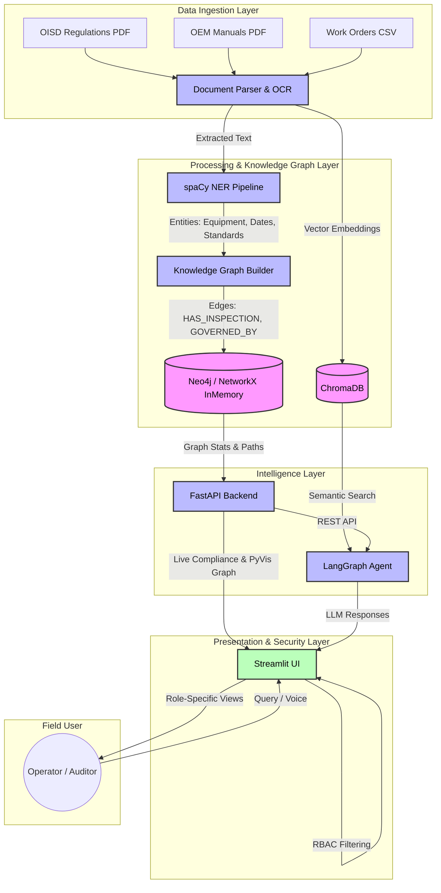

# Industrial Operations Brain — Ingestion Service

**Role: Multi-Format Ingestion Pipeline (Person 1)**

Processes PDFs, scanned documents, spreadsheets, and work orders into clean structured JSON for RAG and knowledge graph consumption.

---

## System Architecture



---
## 3-Command Startup

```bash
pip install -r ingestion/requirements.txt
python setup.py
uvicorn ingestion.main:app --reload
```

Then open: **http://localhost:8000/docs**

---

## What It Does

| Input | Processor | Output |
|---|---|---|
| Text PDF | PyMuPDF | Text + tables per page |
| Scanned PDF | Tesseract OCR | Text + confidence score |
| Mixed PDF | Auto-detect | Both text + OCR |
| Excel / XLSX | openpyxl + pandas | Tables per sheet |
| Work order CSV | Custom parser | Normalized records |
| P&ID drawing | OpenCV + Tesseract | Equipment tags |

---

## API Endpoints

### `POST /ingest/`
Upload a file for ingestion.

**Example (curl):**
```bash
curl -X POST http://localhost:8000/ingest/ \
  -F "file=@demo_docs/sop_pump_p101_rev4.pdf"
```

**Response:**
```json
{
  "doc_id": "sha256hash...",
  "source": "sop_pump_p101_rev4.pdf",
  "doc_type": "TEXT",
  "pages": [...],
  "metadata": {
    "rev_number": "4",
    "date": "15/01/2024",
    "equipment_ids": ["P-101", "HV-204", "FCV-301"],
    "language": "en",
    "has_version_conflict": true,
    "superseded_by": null
  },
  "total_pages": 2,
  "processing_time_ms": 145.3,
  "warnings": ["Version conflict: this document (Rev 4) supersedes existing doc..."]
}
```

### `GET /health`
Check all services are running.

---

## Features

- **Version conflict detection**: Upload SOP Rev 3 then Rev 4 — system flags Rev 3 as superseded
- **Work order normalization**: Handles `EqpNum`, `AssetID`, etc. → standard `equipment_id`
- **Equipment ID extraction**: Finds `P-101`, `HV-204`, `FCV-301` etc. from any text
- **Deduplication**: SHA-256 hash check — same file won't be ingested twice
- **Graceful degradation**: Bad PDFs, OCR timeouts, missing IDs — all handled with error flags, not crashes
- **Hindi-English support**: Detects Devanagari characters, flags mixed-language docs

---

## Demo Corpus

Generate all 7 demo documents:
```bash
python demo_docs/generate_demo_docs.py
```

| File | Purpose |
|---|---|
| `sop_pump_p101_rev3.pdf` | Outdated SOP (50 Nm torque) — triggers version conflict |
| `sop_pump_p101_rev4.pdf` | Current SOP (80 Nm torque) — supersedes Rev 3 |
| `inspection_checklist_e201.pdf` | Equipment inspection checklist with table |
| `oem_manual_fcv301_excerpt.pdf` | OEM manual with complex formatting |
| `email_archive_p101_maintenance.pdf` | Maintenance email thread |
| `work_orders_june2024.csv` | Work order history with mixed column names |
| `monthly_inspection_june2024.xlsx` | Inspection sheet (Excel) |

---

## If Demo Crashes

```bash
./restart.sh
```

---

## Project Structure

```
ingestion/
├── main.py              # FastAPI entry point
├── health.py            # /health endpoint
├── routers/ingest.py    # /ingest/ endpoint
├── processors/
│   ├── pdf_processor.py
│   ├── ocr_processor.py
│   ├── table_processor.py
│   ├── excel_processor.py
│   ├── workorder_processor.py
│   └── image_processor.py
├── utils/
│   ├── metadata.py      # Revision/date/equipment ID extraction
│   ├── deduplication.py # SHA-256 dedup
│   ├── validation.py    # MIME type checks
│   └── language.py      # Hindi-English detection
└── models/schemas.py    # Pydantic output schemas
```
