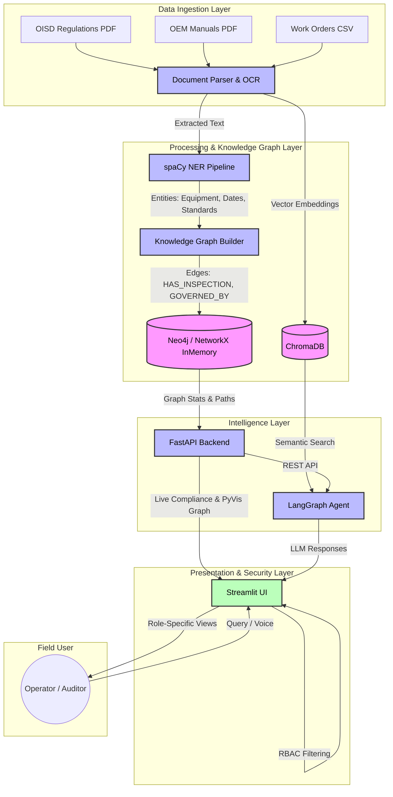

# Industrial Operations Brain 🧠⚙️

An intelligent, context-aware RAG and Knowledge Graph system designed for industrial and manufacturing environments. This system ingests complex industrial documents (SOPs, Work Orders, P&IDs, OEM Manuals, Regulations), builds a semantic knowledge graph, and provides role-based, accurate answers to operators, engineers, and auditors using an advanced LangGraph reasoning agent.

---

## 🏗️ System Architecture



---

## ✨ Core Features

1. **Multi-Format Document Ingestion**: Seamlessly ingests text PDFs, scanned documents (Tesseract OCR), Excel files, CSVs, and mixed-language formats. Handles deduplication and version conflict detection.
2. **Dynamic Knowledge Graph**: Uses configuration-driven rules (`graph_config.yaml`, `compliance_rules.yaml`) and fuzzy alias resolution to map relationships between Equipment, Documents, Regulations, and Maintenance Dates.
3. **LangGraph Reasoning Agent**: An intelligent backend agent that coordinates between vector search (ChromaDB), graph queries, and LLM synthesis to ensure highly faithful and accurate responses while preventing hallucinations.
4. **Real-time Metrics & Fallback Strategy**: Tracks RAG faithfulness scores, corpus coverage, and API latency. Features an emergency fallback toggle for live demos.
5. **Full-stack Security & RBAC**: Implements Role-Based Access Control (RBAC) across both the Streamlit frontend and the FastAPI backend (`X-User-Role` headers). 
6. **Interactive Visualization**: Explores the knowledge graph visually using an embedded PyVis dashboard inside Streamlit.

---

## 🚀 Getting Started

### Prerequisites
- Python 3.9+
- Tesseract OCR (`brew install tesseract` or `apt-get install tesseract-ocr`)

### 1. Install Dependencies
```bash
pip install -r requirements.txt
pip install -e .
```

### 2. Generate Demo Corpus
Generate the synthetic dataset of 7 industrial documents (SOPs, Work Orders, OEM Manuals, Checklists):
```bash
python scripts/generate_demo_docs.py
```

### 3. Run the Backend API (FastAPI)
The backend manages data ingestion, the knowledge graph, and the LangGraph agent:
```bash
python app.py
```
> The API will be available at `http://localhost:8000`. Swagger UI is at `http://localhost:8000/docs`.

### 4. Run the Frontend (Streamlit)
Open a new terminal and run the interactive chat and dashboard UI:
```bash
streamlit run streamlit_app.py
```
> The UI will be available at `http://localhost:8501`.

---

## 📡 API Endpoints

### Ingestion API
- `POST /ingest/`: Upload documents to the pipeline (async chunking & OCR).
- `GET /ingest/status/{task_id}`: Check the progress of a large document.
- `GET /ingest/list`: View all successfully ingested files.
- `POST /ingest/reset`: Purge the vector DB and graph for a clean demo run.

### Agent API
- `POST /chat`: Submit a query to the LangGraph RAG pipeline (requires `X-User-Role` header).
- `POST /stream`: Stream the reasoning chain tokens directly to the frontend.
- `GET /metrics`: Fetch live metrics (corpus coverage, cache size).
- `POST /fallback/toggle`: Toggle the static emergency demo fallback mode.

---

## 🛡️ Role-Based Access Control (RBAC)

The system supports 3 default personas. Queries triggering restricted terms (e.g., `e-201`, `audit log`) are actively blocked at the backend for unauthorized roles.

| Role | Access Scope | Description |
|------|-------------|-------------|
| **Ravi (Operator)** | SOPs, Checklists | Field technician executing manual operations. Denied access to sensitive compliance or engineering logs. |
| **Priya (Engineer)** | SOPs, P&IDs, OEM Manuals | Process engineer troubleshooting equipment performance. |
| **Arjun (Auditor)** | All Documents, Standards | Compliance lead checking logs against national standards (OISD, PESO). |

---

## 📂 Project Structure

```text
├── app.py                     # Main FastAPI server and RAG pipeline endpoints
├── streamlit_app.py           # Streamlit frontend with interactive UI & Chat
├── src/                       
│   ├── agent.py               # LangGraph Agent reasoning engine
│   ├── graph_builder.py       # NetworkX Knowledge Graph and compliance logic
│   └── llm_utils.py           # LLM configurations and prompts
├── ingestion/                 # Multi-format document processing engine
│   ├── main.py                # Ingestion API routes
│   ├── processors/            # PDF, OCR, Excel, CSV processors
│   └── utils/                 # Task managers, pipeline logic, chunking
├── data/                      # Output generated graphs and vector DBs
├── demo_docs/                 # Sample industrial documents
└── scripts/                   # Utility scripts (e.g. data generation, tests)
```

---

## 🛠️ Tech Stack

- **Backend:** FastAPI, Python
- **Frontend:** Streamlit, PyVis, Plotly
- **AI/LLM:** LangChain, LangGraph, OpenAI / Gemini
- **Vector DB:** ChromaDB
- **Knowledge Graph:** NetworkX
- **Document Processing:** PyMuPDF, Tesseract OCR, Pandas
