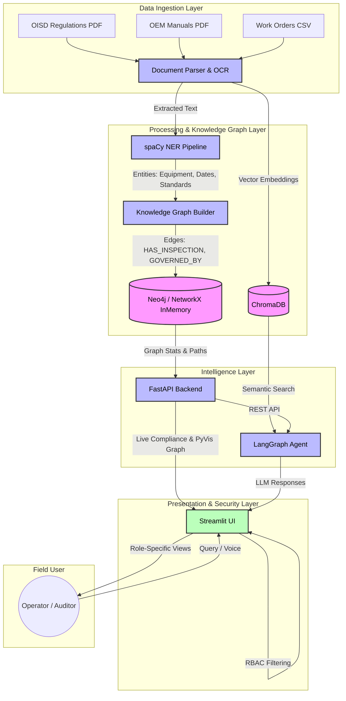

# System Architecture

This architecture outlines the complete pipeline for the **Industrial Operations Brain**.

## Key Components
- **Ingestion**: Handles unstructured PDFs and structured maintenance records.
- **Processing**: Extracts entities using SpaCy and builds relationships.
- **Intelligence**: Combines vector search (ChromaDB) with graph traversals (FastAPI) to answer complex regulatory questions.
- **Presentation**: A Streamlit frontend with built-in RBAC (Role-Based Access Control) to serve personalized dashboards to operators and auditors.
