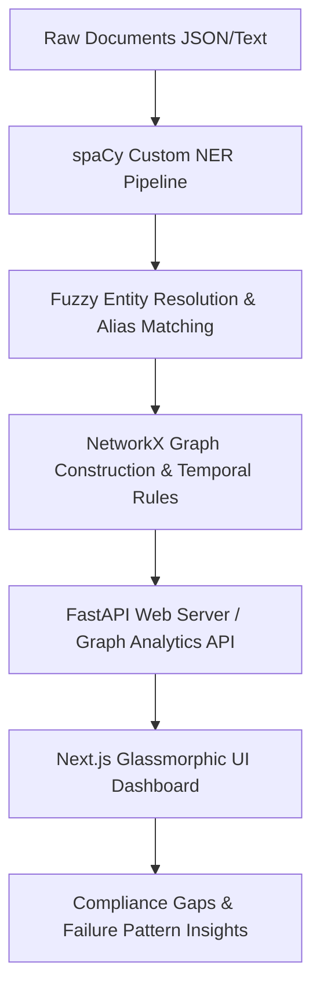
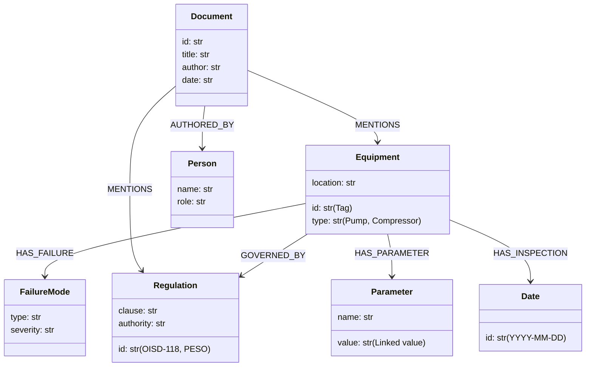
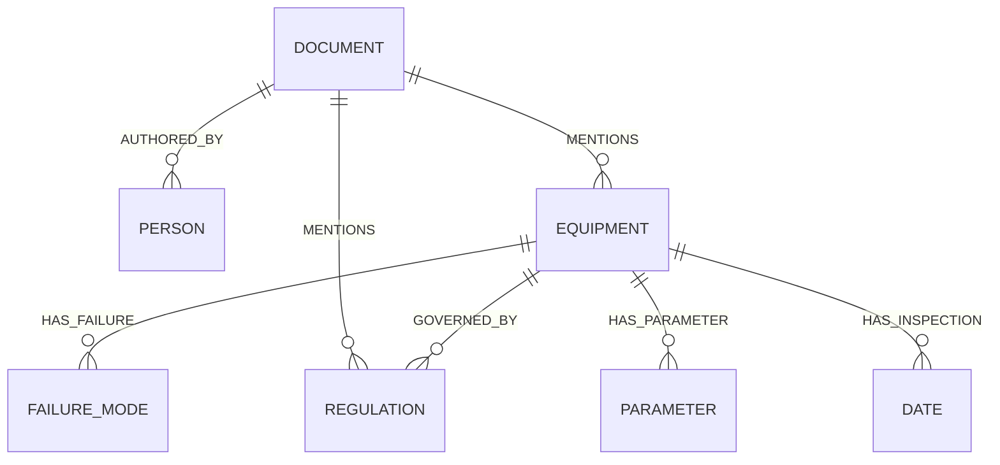

# Technical Architecture Summary - Person 2

This document details the architecture, entity resolution pipeline, and schema design of the structured knowledge graph built for the industrial copilot.

---

## 1. Pipeline Architecture

The system extracts structured relationships from raw industrial logs, regulations, and manuals in three main pipeline phases:

### Phase A: Entity Extraction (spaCy + Custom Regex)
- Uses **spaCy (`en_core_web_sm`)** combined with a custom `EntityRuler` to extract domain-specific terminology.
- Captures tags for **EQUIPMENT** (e.g. `P-101`), **REGULATION** (e.g. `OISD-118`, `PESO`), **FAILURE_MODE** (`seal leak`, `bearing seizure`), and **PARAMETER** (`discharge pressure`, `bearing temperature`).
- Uses proximity-based resolution to associate parameters with their values (e.g., matching "82 C" with "bearing temperature").

### Phase B: Alias Resolution (Fuzzy Matcher + Blocklist)
- Employs **RapidFuzz** string similarity mapping to group and merge synonyms (e.g. "Pump P-101" vs "P-101" vs "Pump P101").
- Implements a manual override blocklist to prevent false-positive mergers between highly similar tag strings (e.g. preventing "Pump P-101" from merging with "Pump P-102").

### Phase C: Graph Construction (NetworkX MultiDiGraph)
- Populates a NetworkX `MultiDiGraph` allowing multiple directed edges.
- Creates **sentence-level co-occurrence** relationships to prevent document-wide co-occurrence false positives (e.g. connecting a date to a compliant pump rather than an overdue pump).
- Implements edge-weight aggregation (e.g. incrementing failure counts on `HAS_FAILURE` edges).

---

## 2. Knowledge Graph Schema

Below is the class ontology and the entity-relationship diagram of node classes and edge relations:

### Class Ontology

### Entity-Relationship Diagram

---

## 3. India-Specific Differentiation

The knowledge graph architecture incorporates explicit nodes representing regulatory frameworks governed by Indian oil and gas safety standards (**OISD-118**) and statutory authorities like the Petroleum and Explosives Safety Organisation (**PESO**). By mapping specific equipment tags to their respective governing clauses (e.g. hydrocarbon pump safety under OISD or flammable gas handling under PESO), the system automates real-time compliance gap auditing. This ensures that Indian heavy industrial plants remain aligned with localized, high-stakes statutory mandates, highlighting safety violations before they incur legal liabilities or operational hazards.
